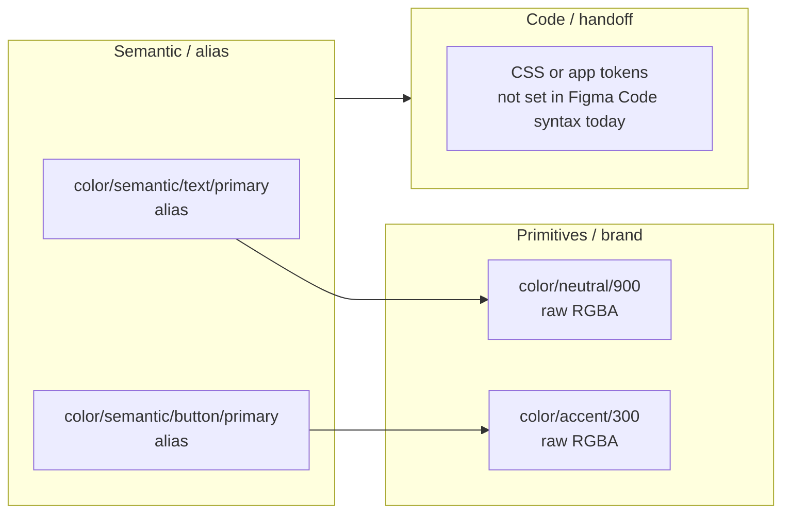

# ArchRecon Web Client Portal — Figma design token structure

**Source file:** [ArchRecon_WebClientPortal_ProductDesign](https://www.figma.com/design/WOx2fmhCGc48eSNgAv7jna/ArchRecon_WebClientPortal_ProductDesign?node-id=6-5648)

This summary reflects the **local variables** in that file as read via the Figma Plugin API (April 2026). Layer `6:5648` is a canvas node in the same file; variables are **file-scoped**, not tied to a single frame.

---

## High-level finding

The file uses **one local variable collection** named **ArchRecon Collection**. There are **no separate Figma collections** labeled “brand,” “alias,” or “mapped.” Instead, those roles appear as **logical layers**:

| Logical layer | How it shows up in Figma | Role |
|---------------|-------------------------|------|
| **Brand / primitives** | Variables with paths like `color/neutral/…`, `color/primary/…`, `color/accent/…`, `space/…`, `font …` | Holds **raw values** (colors, numbers, strings). |
| **Semantic / alias** | Variables under `color/semantic/…` | Mostly **variable aliases** pointing at primitives (or other semantics) in the **same** collection. |
| **Mapped (to code)** | Optional: Figma **Code syntax** (e.g. `WEB`) on each variable | **Not defined** on these variables in the current file (`WEB` code syntax count: **0**). Any mapping to CSS/custom properties is therefore a **downstream** concern (build step, handoff, or future Figma setup). |

So the **connection point** between “brand,” “alias,” and “mapped” is:

1. **Brand → semantic:** `VariableAlias` on semantic tokens (`type: VARIABLE_ALIAS`, `id` → target variable).
2. **Semantic → final value:** Resolve by following aliases until a **non-alias** value (e.g. `RGBA`) is reached.
3. **Mapped → code:** Not encoded in Figma variables today; naming (`color/semantic/text/primary`, etc.) is the stable contract for codegen.

---

## Collection metadata

| Property | Value |
|----------|--------|
| **Name** | ArchRecon Collection |
| **Scope** | Local (`remote: false`) |
| **Extension** | Not an extended collection (`isExtension: false`) |
| **Modes** | Single mode: **Mode 1** (`defaultModeId` present; no multi-brand / light-dark split at collection level in this export) |
| **Variable count** | **165** |
| **Value kinds (approx.)** | **103** variables with **raw** mode values · **62** variables whose mode value is an **alias** to another variable |

**Note:** Reading `hiddenFromPublishing` on this collection can error with a missing node id in some environments; treat publish visibility as **verify in Figma UI** if needed.

---

## Naming taxonomy (prefix counts)

Variables are grouped by the first path segment (before `/`):

| Prefix | Count (approx.) | Typical use |
|--------|-----------------|-------------|
| `color` | 103 | Palettes, states, semantics |
| `space` | 13 | Spacing scale |
| `size` | 9 | Sizing |
| `font size` | 9 | Type scale |
| `line height` | 8 | Typography |
| `opacity` | 7 | Opacity scale |
| `stroke weight` | 5 | Borders |
| `font weight` | 5 | Typography |
| `font family` | 3 | Typefaces |
| `letter spacing` | 3 | Typography |

---

## Semantic color groups (`color/semantic/…`)

Semantic tokens are organized under fixed **third-level** buckets (examples from variable names):

- `color/semantic/background` — default, subtle, elevated, card variants, brand surfaces, inverse, etc.
- `color/semantic/border` — default, subtle, strong, focus, disabled, success, etc.
- `color/semantic/button` — primary / secondary / tertiary variants, hover, text, disabled
- `color/semantic/text` — primary, secondary, muted, inverse, link, disabled
- `color/semantic/icon` — (present in naming scheme; same alias pattern as other semantics)
- `color/semantic/state` — success, warning, error, info (often alias to `color/state/…` primitives)

These entries **connect to brand primitives** through **aliases**, e.g.:

- `color/semantic/text/primary` → `color/neutral/900`
- `color/semantic/button/primary` → `color/accent/300`
- `color/semantic/background/default` → `color/neutral/0`
- `color/semantic/text/link` → `color/primary/500`

Intermediate targets can be another semantic or a **state** token (e.g. borders aliasing `color/semantic/state/error`), which may itself alias a primitive—forming a **short chain** resolved per mode.

---

## Primitive color families (brand palette)

Raw color variables include scaled ramps and one-offs, for example:

- **Neutral:** `color/neutral/0` … `900`, including alpha variants (`…-20`, `…-50`, `0-50`, etc.)
- **Primary:** `color/primary/25` … `900`
- **Accent:** `color/accent/25` … `700` (and related steps)
- **State:** `color/state/…` (e.g. success / warning / error / info backgrounds and borders)

---

## Non-color tokens

Spacing, typography, stroke, and opacity tokens are mostly **raw numeric or string** values (e.g. `space/4` → `16`, `font family/body` → `Catamaran`, `font family/heading` → `Nasalization`, `font family/ui` → `Inter`). They do not use the same `color/semantic/…` alias tree unless you add that pattern later.

---

## Mental model: three-layer token stack (same collection)

---

## Practical implications for implementation

1. **Single source collection** simplifies imports: one library collection to bind in dev mode.
2. **Semantic-first UI** should reference `color/semantic/…` names where possible so palette refactors stay in primitives.
3. **Codegen:** Define your own mapping from these paths to CSS custom properties or theme objects; Figma is not currently emitting `WEB` code syntax for these variables.
4. **Modes:** With only one mode, there is no per-mode alias matrix yet; adding light/dark or themes would mean new modes and possibly new alias targets per mode.

---

## References

- [Figma variables — collections and modes](https://help.figma.com/hc/en-us/articles/15343816063383)
- [Figma Plugin API — `Variable` / `VariableAlias`](https://www.figma.com/plugin-docs/api/Variable/)
